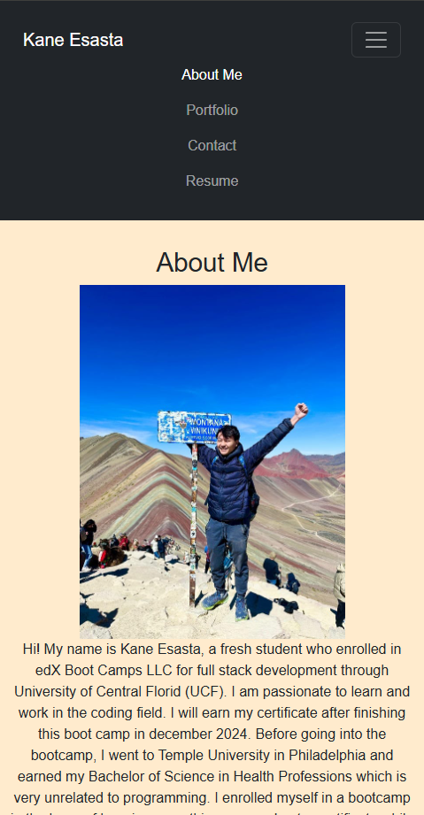

# K-react-portofolio
  
  ## Description
  Welcome! This is my portfolio. Feel free to give any comments or advices that may help me to improve my portfolio. This portfolio includes About Me, Portfolio, Contact, and Resume pages.
  ## Table of Contents
  * [Installation](#installation)
  * [Usage](#usage)
  * [Credits](#credits)
  * [License](#license)
  * [Badges](#badges)
  * [Features](#features)
  * [How to Contribute](#howToContribute)
  * [Test](#test)
  ## Installation
  You can follow the link url to the deployed website. This portfolio is deployed using Netlify: https://k-react-portfolio.netlify.app/
  ## Usage
  Once you follow the link to the deployed portfolio, you will be able to see something like this:   
  ## Credits
  N/A
  ## License
  MIT 
  ## Badges
  N/A
  ## Features
  * React.js
  * Vite
  * Bootstrap
  * Netlify (for deployment)
  ## How to Contribute
  You can share your comments or inputs on what to add by contacting me.
  ## Questions
  Contact:
  * Name: Kane Esasta
  * Email: kaneesasta@gmail.com
  * Github: [kaneganteng](https://github.com/kaneganteng)